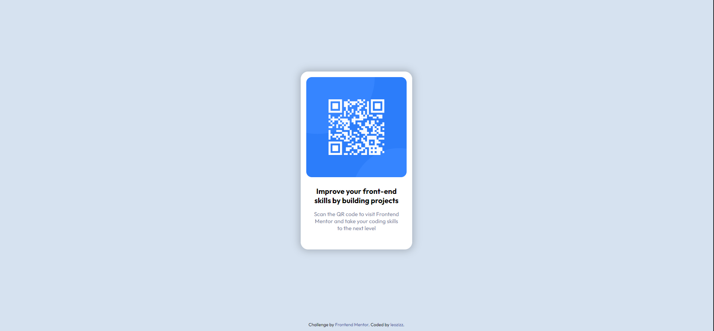

# Frontend Mentor - QR Code component challenge solution

This is a solution to the [QR code component challenge](https://www.frontendmentor.io/challenges/qr-code-component-iux_sIO_H). Frontend Mentor challenges help you improve your coding skills by building realistic projects. 

## Table of contents

- [Overview](#overview)
  - [The challenge](#the-challenge)
  - [Screenshot](#screenshot)
  - [Links](#links)
- [My process](#my-process)
  - [Built with](#built-with)
  - [Continued development](#continued-development)
- [Author](#author)
- [Acknowledgments](#acknowledgments)

## Overview

### The challenge

The challenge is to build a QR code component and make it look as close to the design reference as possible.

### Screenshots

#### Desktop Preview

#### Mobile Preview

### Links

- Solution URL: [QR Code Component - Leozizz GitHub]()
- Live Site URL: [QR Code Component - Leozizz ]()

## My process

### Built with

- HTML5
- CSS custom properties
- CSS Flexbox

### Continued development

Currently I don't have in-depth knowledge of HTML and CSS, but I am studying more and more every day and I intend to improve my skills so that I can improve this and other projects in the future.

## Author

- Website - [Leonardo Silva - leozizz](https://leozizz.github.io)
- LinkedIn - [Leonardo Silva](https://www.linkedin.com/in/leozizz/)
- GitHub - [leozizz](https://github.com/leozizz)
- Frontend Mentor - [@leozizz](https://www.frontendmentor.io/profile/leozizz)